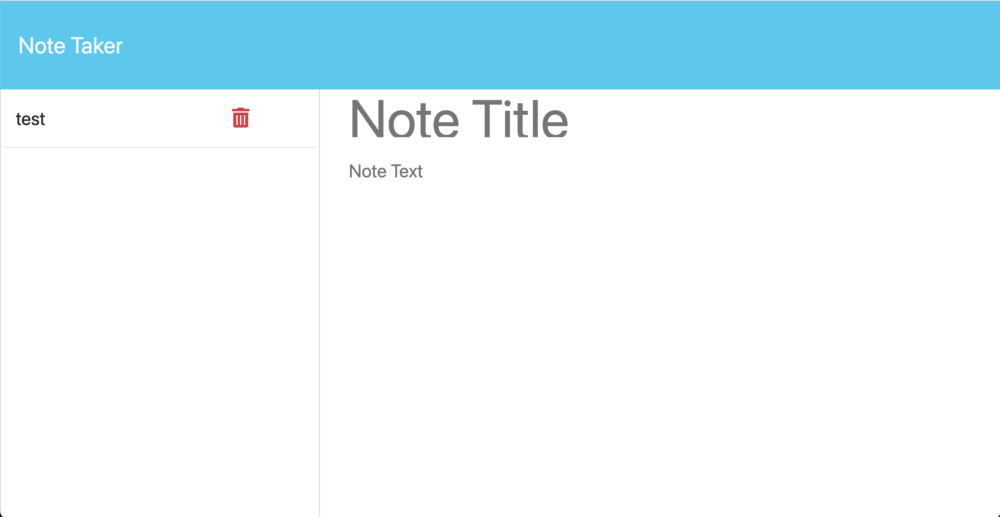

# Logo Creator
  
  
## Description
My motivation to create this project was to create a notetaking application to take down notes. I built this project to create a streamlined way to keep all of my notes in one place. This application solves the problem of not having a note taking application. I learned how to use GET, POST, and DELETE requests.

## Deployed Site

This application is accessible here: https://notetaker-aajh.onrender.com/

## Installation

To install the project, pull the code from https://www.github.com/stefanfilm/notetaker and open it in a code editor. Open the server.js in the code editor and view the JavaScript. 

## Usage

Navigate to the directory in a terminal window. Type in node server.js. Open your local 3001 port. Click Get Started. Enter a note and click save note. 

    ```md
    
    ```


  ## License
  This project is licensed with the MIT license.
  

  ## Contributions
  Self. This project was made under the instruction of Mark Carlson in the UC Berkeley Software Development Bootcamp.

 ## Questions
  You can contact me at stefan.wanigatunga@gmail.com
  My GitHub Username is stefanfilm